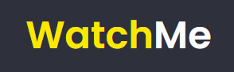
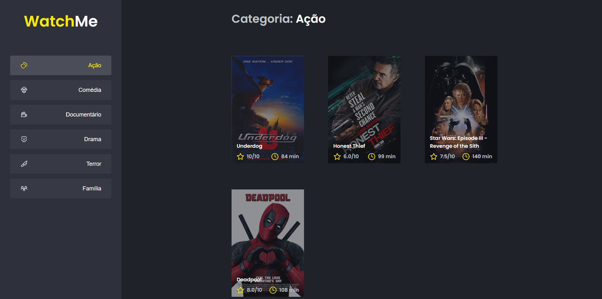

___

<div align="center">
    
</div>

## :dart: Sobre

Uma aplicação de visualização de filmes filtrando por gênero.

Desenvolvido a partir de um projeto pronto, com o objetivo de treinar o conhecimento refatorando a aplicação, tirando toda a responsabilidade do arquivo App, componetizando a aplicação. Utilizado uma fake API com JSON-Server para obter informações dos filmes.

Essa mesma aplicação foi utilizada para treinar alguns conceitos de performance do React, como o memo, useMemo e useCallback.



## :rocket: Tecnologias

As seguintes tecnologias foram utilizadas no projeto:

* [React](https://pt-br.reactjs.org/E)
* [json-server](https://www.npmjs.com/package/json-server)
* [axios](https://axios-http.com/ptbr/docs/intro)

## :white_check_mark: Requerimentos

- [Node](https://nodejs.org/en/)
- [Yarn](https://yarnpkg.com/lang/en/)

## :checkered_flag: Começando

```bash
# Clone this project
$ git clone https://github.com/ricardoltt/watchme

# Access
$ cd watchme

# Install dependencies
$ yarn

# Run fake api
$ yarn server

# Run the project
$ yarn dev

# The server will initialize in the <http://localhost:8080>
```
<center>

### Let's code! 🚀
Made with love by **Ricardo Temoteo** ❤️ Me adiciona no [Linkedin!](https://www.linkedin.com/in/ricardoltt/)
